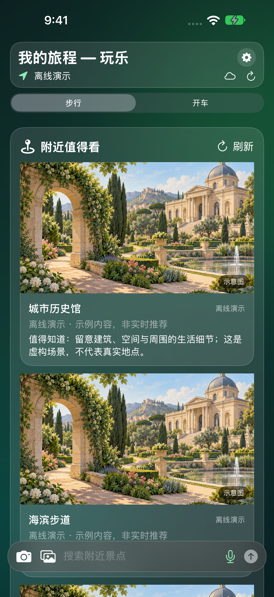
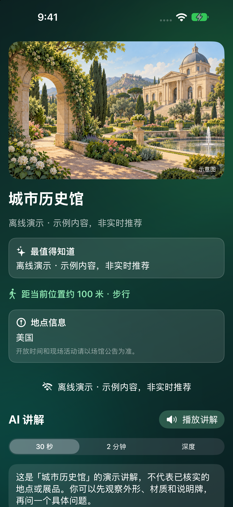
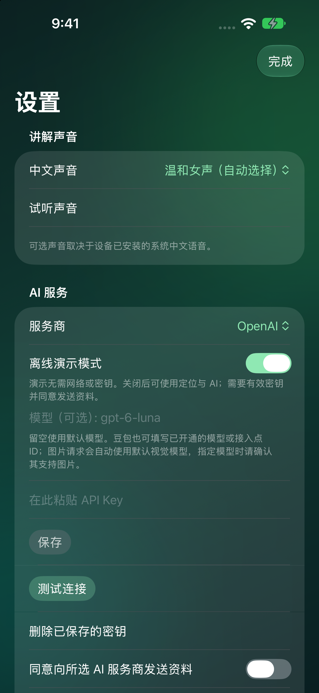
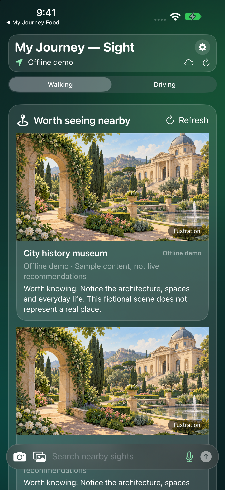
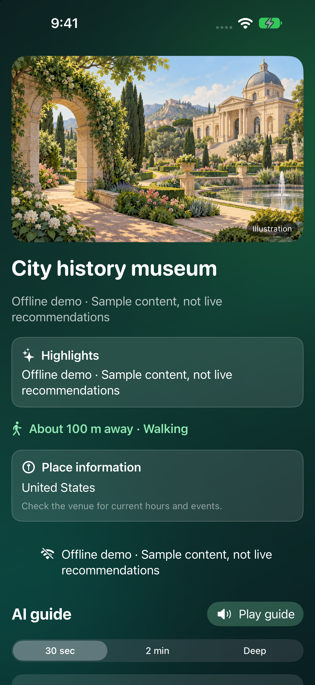
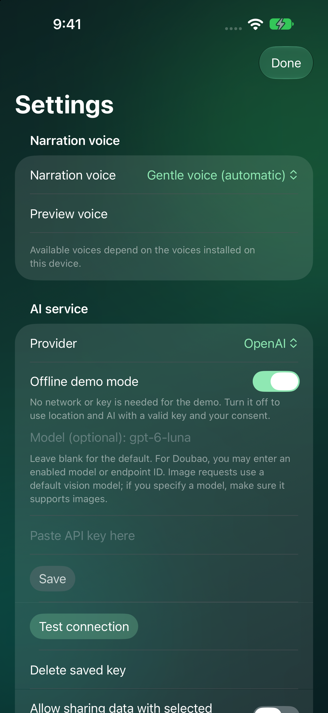

# My Journey Sight

**我在旅途-玩乐 · iPhone 公开版 / Public edition**

发现附近值得看的地方，也让旅途中看到的建筑、街区和风景，变成可以听的故事。

Discover interesting places nearby and turn the buildings, neighborhoods, and scenery you notice into stories you can listen to.

[支持与用法 / Support](https://wliao78.github.io/My-Journey-Support/#support) · [中文隐私政策](https://wliao78.github.io/My-Journey-Support/#privacy-zh) · [Privacy policy](https://wliao78.github.io/My-Journey-Support/#privacy-en) · [反馈 / Issues](https://github.com/wliao78/My-Journey-Sight-Public/issues)

## 发行状态

版本 1.0 已于 2026 年 10 月 3 日提交 Apple 审核，当时状态为 **Waiting for Review**，设置为审核通过后免费自动发布。这是提交时的记录，不代表已获批准或已经上架。

[App Store 预留链接](https://apps.apple.com/app/id6818730266)：审核通过并发布后可用；发布前可能无法打开。最新审核状态需以 App Store Connect 为准。

[发行记录](AppStore/SubmissionStatus.txt) · [中英文商店文案](AppStore/metadata/) · [全部界面截图](AppStore/screenshots/) · [应用图标](AITourGuide/Assets.xcassets/AppIcon.appiconset/AppIcon-1024.png)

## 主要功能

- 按步行或开车方式探索附近地点。
- 拍照或选择相册照片，向 AI 提问并生成讲解。
- 讲解可选 30 秒、2 分钟或深度版本，并配有语音播放。
- 查看地点、地址与路线，并打开地图继续探索。

## 中文界面

| 附近发现 | 景点讲解 | 服务商设置 |
| --- | --- | --- |
|  |  |  |

截图来自实际应用的离线演示模式。演示内容和示意图片用于展示功能，不代表真实预订、实时推荐或已完成事实核实。

## 开始使用

1. 先浏览明确标注的离线示例与图片。
2. 如需实时地点探索或照片讲解，关闭演示模式并按需允许定位、相机或语音权限。
3. 配置自己的 AI 密钥并同意数据共享，选择讲解长度后阅读或收听。

## AI 服务与隐私

支持 OpenAI、Anthropic Claude、Google Gemini，以及 DeepSeek、通义千问、Kimi、智谱 GLM、豆包和文心。请使用你自己的 API Key；不同服务商、模型的文字或图像能力可能不同，API 费用由服务商收取，不包含在免费下载中。

AI 功能需要先明确同意数据共享。相关文字、照片或请求信息会发送给所选服务商；密钥保存在本机钥匙串。演示模式无需密钥。仓库不包含私人版 Git 历史、API 密钥或个人旅行资料。

AI 可能误认地点或讲错历史细节。开放时间、通行条件及安全事项请以现场和官方信息为准。

## English overview

- Nearby discovery for walking or driving.
- Photo-based questions using the camera or photo library.
- 30-second, two-minute, and in-depth explanations with spoken playback.
- Place details, addresses, routes, and map handoff.

| Nearby discovery | Place explanation | Provider settings |
| --- | --- | --- |
|  |  |  |

These are actual app screenshots in offline demo mode. Sample data and illustrative images are not live recommendations, real bookings, or verified travel advice.

### Getting started

1. Explore the clearly labeled offline samples and images.
2. For live discovery or photo explanations, turn off demo mode and grant location, camera, or speech access only as needed.
3. Configure your key, accept AI data sharing, then choose an explanation length and read or listen.

Optional AI features use your own key for OpenAI, Claude, Gemini, DeepSeek, Qwen, Kimi, GLM, Doubao, or ERNIE. Provider and model capabilities vary. Explicit data-sharing consent is required, and your chosen provider may charge for API usage. Keys are stored in the device Keychain. Verify important travel information with original documents, venues, and official sources.

Version 1.0 was submitted for Apple review on October 3, 2026, with free automatic release after approval. [App Store link](https://apps.apple.com/app/id6818730266) is reserved for release and may not resolve beforehand. Submission is not approval or availability.

## 开发与设备支持

使用 Xcode 打开 `My Journey Sight.xcodeproj`，选择 `My Journey Sight` scheme。本机安装需使用自己的开发者签名配置。

Swift 6 项目，最低 iOS 18.0，面向竖屏 iPhone。简体中文和英文界面随系统语言切换；此独立公开版不含私人版的历史或个人资源。

Open `My Journey Sight.xcodeproj` in Xcode and select the matching scheme. Use your own development signing settings for device installation. Requires iOS 18.0 or later; designed for portrait iPhone use with English and Simplified Chinese localization.

## My Journey 系列

| App | 用途 / Purpose |
| --- | --- |
| [我在旅途-行程规划 / My Journey Plan](https://github.com/wliao78/My-Journey-Plan-Public) | 安排与准备 / Itinerary and preparation |
| [我在旅途-吃喝指南 / My Journey Food](https://github.com/wliao78/My-Journey-Food-Public) | 附近吃喝 / Nearby food |
| [我在旅途-玩乐 / My Journey Sight](https://github.com/wliao78/My-Journey-Sight-Public) | 发现与讲解 / Discovery and explanations |
| [我在旅途-梦游 / My Journey Dream](https://github.com/wliao78/My-Journey-Dream-Public) | 旅行灵感 / Journey inspiration |

[项目支持](https://wliao78.github.io/My-Journey-Support/#support) · [联系 / Contact](mailto:tinyworm@gmail.com)
